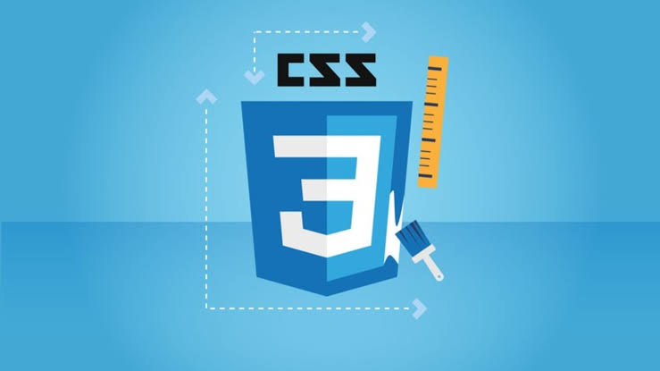

# css3-cfb-cursos
Arquivos das Aulas do Curso CSS3 
Professor Bruno Campos CFB cursos 

`CSS3 é a terceira mais nova versão das famosas Cascading Style Sheets (ou simplesmente CSS), pela qual se define estilos para um projeto web (página de internet). Com efeitos de transição, imagem, imagem de fundo/background e outros, pode-se criar estilos únicos para seus projetos web, alterando diversos aspectos de design no layout da página.`

## :ledger: Aulas 

- 00 : `comentários /*  */`
- 01 : `seletores . # tag`
- 02 : `background-image: url();`
- 03 : `border` 
- 04 : `cores RGB e Transparência rgba(alpha)`
- 05 : `margens e centralização`
- 06 : `padding`
- 07 : `Preenchimentos & Gradientes`
- 08 : `Sombras`
- 09 : `Formatação de textos`
- 10 : `Formatação para fontes`
- 11 : `Formatação para links`
- 12 : `Transformações 2D`
- 13 : `Transformações 3D`
- 14 : `Formatação /listas`
- 15 : `Formatação /tabelas`
- 16 : `Outline`
- 17 : `Display parte1`
- 18 : `Display parte2`
- 19 : `FlexBox display:flex`
